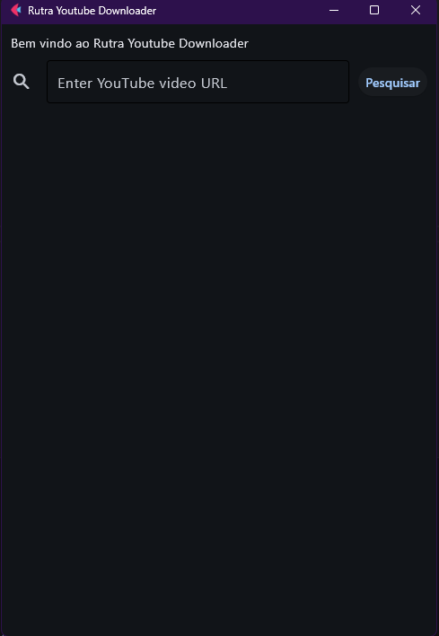
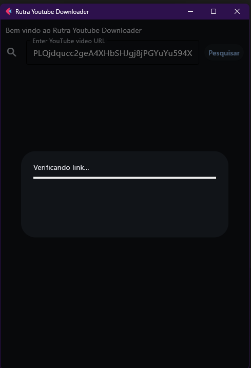

# Rutra YouTube Downloader App


**YouTube Downloader App** é uma aplicação simples e intuitiva para download de vídeos e áudios do YouTube, desenvolvida com Python, utilizando as bibliotecas **Flet** para interface gráfica e **yt-dlp** para gerenciamento dos downloads.



---

## **Recursos**
- Download de vídeos em alta qualidade.
- Download de áudios com extração para MP3.
- Interface gráfica responsiva e moderna.
- Progresso detalhado com barra de progresso e informações do status.
- Opção de cancelar downloads em andamento.

---

## **Tecnologias Utilizadas**
- [Python 3.13.0](https://www.python.org/downloads/)
- [Flet](https://flet.dev/) - Biblioteca para criação de interfaces gráficas modernas.
- [yt-dlp](https://github.com/yt-dlp/yt-dlp) - Ferramenta para download de vídeos e áudios.

---

## **Pré-requisitos**
Antes de executar o aplicativo, certifique-se de que você tenha:
1. **Python 3.8 ou superior** instalado.
2. O [FFmpeg](https://ffmpeg.org/download.html) instalado e configurado no sistema.
3. As bibliotecas necessárias instaladas (instruções abaixo).

---

## **Como Clonar o Repositório e Executar**
### 1. **Clone o Repositório**
Abra o terminal ou prompt de comando e execute:
```bash
git clone https://github.com/artur-calderon/Rutra-Youtube-Downloader.git
cd youtube-downloader-app
flet run
